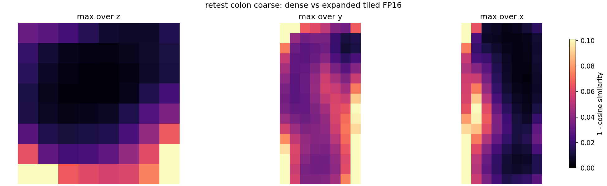
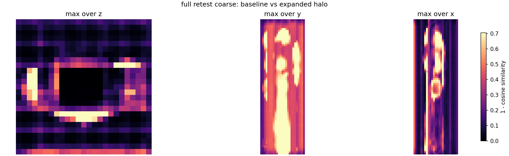

# Quadra tiled-embedding and streaming-matching validation

## Technical summary

**The tested tile workflow is supported as not materially different from the bounded dense reference under the prespecified engineering criteria.** The assessment covers 5 Test–Retest subjects (`quadra_hc_021`, `quadra_hc_022`, `quadra_hc_023`, `quadra_hc_024`, `quadra_hc_025`) resampled to exact `2 mm` isotropic spacing.

- Streamed and dense matching on identical embeddings returned the same argmax coordinate in **1000/1000 comparisons**: **PASS**.
- Dense versus expanded-tile crop correspondence: **96.9%** of directional matches were within 2 mm; cycle-error difference median/p95 was **0.000/0.761 mm**: **PASS**.
- Baseline-versus-expanded full-subject halo stability was available for **5/5 subjects**; pooled correspondence displacement median/p95 was **0.000/0.000 mm** and cycle-error change median/p95 was **0.000/0.362 mm**: **PASS**.
- Similarity-score differences are reported as a numerical diagnostic only; exact argmax coordinates are the hard streamed-matcher correctness criterion.

## Definitions and tested geometry

All tensor sizes use `(x, y, z)` order in the resampled 2 mm voxel grid.

- **Dense inference:** one bounded organ-centred crop is passed through the encoder in a single operation, so the crop has no internal tile boundaries.
- **Tile:** one encoder input window extracted from the resampled volume.
- **Halo:** contextual voxels surrounding the retained centre of a tile. Halo voxels influence the descriptor but are discarded from that tile's output; the listed halo applies on each side of every axis.
- **Retained core:** the central tile region copied into the global embedding cache. Adjacent cores cover the subject without averaging descriptors.
- **Seam:** a plane where adjacent retained cores meet. It is not an image discontinuity, but points close to a seam may have been encoded with different contextual windows.
- **Streamed global matching:** similarity is evaluated over every target voxel in memory-bounded chunks while retaining the global maximum. Chunk size changes memory scheduling, not the anatomical search range.

| Configuration | Encoder input | Halo on each side | Retained core |
|---|---:|---:|---:|
| Dense crop | `128×128×64` = `256×256×128 mm` | None | Entire bounded crop |
| Baseline tile | `128×128×64` = `256×256×128 mm` | `32×32×16` = `64×64×32 mm` | `64×64×32` = `128×128×64 mm` |
| Expanded tile | `160×160×80` = `320×320×160 mm` | `48×48×24` = `96×96×48 mm` | `64×64×32` = `128×128×64 mm` |

## Experimental design

The engineering run used `SAM.pth` with SHA-256 `8dfedc38f587b1411fe295ae671b481ba8c92b768ae234ade982f959b70d4874`, configuration SHA-256 `12f938e31025a466f23b2b5ee25921a95b34cf6e516566229bf92b1876564df4`, and fixed random seed `1`. The original SAM checkpoint is used to test implementation behaviour, not to claim scientific performance of the Quadra fine-tuned model.
The validator source commit was `130f854fe668579486618bcc2d67de3dce1f1d1b`. This identifier is supplied explicitly during aggregation because schema-version-1 manifests do not embed a Git commit.

For every subject, 5 organs (`bladder`, `colon`, `kidney`, `liver`, `lungs`) were tested. The bounded crop phase used 20 queries per organ (100 per subject). The full phase used 100 queries per organ (500 per subject). Forward and backward displacement values are both included; cycle-error change contributes one value per query.

The validation separates three questions:

1. Dense and streamed search consume identical embeddings. Exact argmax coordinates test the streaming implementation.
2. Dense and tiled encoders consume the same normalized organ crop. Descriptor and correspondence changes test tile-context effects.
3. The complete subject is encoded with baseline and expanded halos. Their differences test halo sensitivity while both retain unrestricted global search.

## Streamed matching is coordinate-exact

Across 1000 forward/backward crop comparisons, the coordinate agreement rate was **100.0%**. Score absolute-difference median/p95/max was `7.719e-06` / `3.201e-05` / `6.247e-05`. The score differences arise from floating-point operation ordering and do not change the selected coordinate in this test.

| Subject | Exact coordinates | Score-difference p95 | Score-difference max |
|---|---:|---:|---:|
| `quadra_hc_021` | 200/200 | 3.040e-05 | 4.637e-05 |
| `quadra_hc_022` | 200/200 | 3.466e-05 | 6.247e-05 |
| `quadra_hc_023` | 200/200 | 2.932e-05 | 4.625e-05 |
| `quadra_hc_024` | 200/200 | 3.008e-05 | 6.104e-05 |
| `quadra_hc_025` | 200/200 | 3.532e-05 | 5.847e-05 |

## Expanded tiling remains close to dense crop inference

The expanded configuration is the primary candidate because it increases anatomical context without changing the retained core or global search space. Descriptor thresholds are evaluated separately for each subject; correspondence values below are calculated from raw query rows rather than averaging subject medians.

| Subject | Worst median cosine | Worst p01 cosine | Worst seam drop | Directions ≤2 mm | Displacement p95 (mm) | Cycle Δ p95 (mm) |
|---|---:|---:|---:|---:|---:|---:|
| `quadra_hc_021` | 0.997900 | 0.992456 | 0.000000 | 95.5% | 2.000 | 1.447 |
| `quadra_hc_022` | 0.998631 | 0.993913 | 0.000000 | 98.0% | 0.000 | 0.000 |
| `quadra_hc_023` | 0.998066 | 0.977264 | -0.000000 | 93.0% | 6.625 | 11.913 |
| `quadra_hc_024` | 0.998608 | 0.991623 | -0.000000 | 98.5% | 0.000 | 0.000 |
| `quadra_hc_025` | 0.999410 | 0.994304 | 0.000000 | 99.5% | 0.000 | 0.000 |
| **Pooled** | — | — | — | **96.9%** | **0.000** | **0.761** |

The following heatmap is the crop/feature-level case with the lowest first-percentile descriptor cosine. It shows `1 - cosine similarity`; it is included to localize the worst numerical result, not as a representative average.

## Full-subject results are a halo-sensitivity test

A complete dense 2 mm subject is intentionally not materialized. Therefore this comparison cannot prove full-volume dense equivalence; it tests whether increasing halo context materially changes the final correspondences.

| Subject | Full status | Directions ≤2 mm | Displacement median/p95 (mm) | Cycle Δ median/p95 (mm) |
|---|---|---:|---:|---:|
| `quadra_hc_021` | `complete` | 96.6% | 0.000/0.076 | 0.000/0.785 |
| `quadra_hc_022` | `complete` | 96.8% | 0.000/0.000 | 0.000/0.000 |
| `quadra_hc_023` | `complete` | 96.6% | 0.000/0.000 | 0.000/0.000 |
| `quadra_hc_024` | `complete` | 94.2% | 0.000/3.645 | 0.000/1.981 |
| `quadra_hc_025` | `complete` | 98.4% | 0.000/0.000 | 0.000/0.000 |
| **Pooled** | 5/5 complete | **96.5%** | **0.000/0.000** | **0.000/0.362** |

The selected full-subject heatmap is the subject/timepoint/feature level with the lowest first-percentile descriptor cosine between baseline and expanded halos.

## Organ-level sensitivity and outliers

Colon is displayed explicitly because large physiological displacement is expected, but it uses the same sampling and thresholds as every other organ. Isolated model mismatches are retained rather than removed.

| Organ | Crop directions ≤2 mm | Crop displacement p95 | Crop cycle Δ p95 | Full directions ≤2 mm | Full displacement p95 | Full cycle Δ p95 |
|---|---:|---:|---:|---:|---:|---:|
| bladder | 97.5% | 0.000 | 0.041 | 95.4% | 2.000 | 0.950 |
| **colon** | 95.0% | 2.073 | 3.528 | 94.3% | 4.000 | 2.651 |
| kidney | 96.5% | 2.000 | 0.489 | 97.0% | 0.000 | 0.000 |
| liver | 96.0% | 0.100 | 0.846 | 97.2% | 0.000 | 0.000 |
| lungs | 99.5% | 0.000 | 0.000 | 98.7% | 0.000 | 0.000 |

Counts below use strict `>` thresholds. Directional counts combine forward and backward comparisons; cycle counts contain one value per query.

| Comparison | Denominator | >2 mm | >4 mm | >10 mm | >20 mm |
|---|---:|---:|---:|---:|---:|
| Crop displacement | 1000 | 31 | 20 | 15 | 6 |
| Crop cycle Δ | 500 | 19 | 11 | 9 | 1 |
| Full displacement | 5000 | 174 | 145 | 85 | 47 |
| Full cycle Δ | 2500 | 82 | 60 | 29 | 8 |

## Seam proximity does not by itself establish causation

A row is labelled near a seam when either its query or candidate target lies within 4 mm of a retained-core seam. A correspondence outlier is a row whose larger forward/backward displacement exceeds 4 mm.

| Phase | Near-seam outliers | Far-from-seam outliers | Descriptive risk ratio |
|---|---:|---:|---:|
| Dense vs expanded crop | 4/227 (1.8%) | 12/273 (4.4%) | 0.40 |
| Baseline vs expanded full | 39/965 (4.0%) | 59/1535 (3.8%) | 1.05 |

These are descriptive rates, not an inferential test. A higher near-seam rate would justify targeted follow-up only if it recurs across subjects and is not explained by organ composition or difficult anatomy.

## Computational profile

Reported seconds are sums of saved encoder and matcher profiles, not wall-clock job duration; cache reuse can make them differ from terminal elapsed time.

| Subject | Recorded profile time (min) | Peak allocated GPU memory (GiB) | GPU |
|---|---:|---:|---|
| `quadra_hc_021` | 5.0 | 1.110 | NVIDIA RTX A6000 |
| `quadra_hc_022` | 5.1 | 1.110 | NVIDIA RTX A6000 |
| `quadra_hc_023` | 4.8 | 1.110 | NVIDIA RTX A6000 |
| `quadra_hc_024` | 4.8 | 1.110 | NVIDIA RTX A6000 |
| `quadra_hc_025` | 5.0 | 1.110 | NVIDIA RTX A6000 |

## Interpretation and recommendation

**Overall engineering interpretation:** The tested tile workflow is supported as not materially different from the bounded dense reference under the prespecified engineering criteria.

Use the expanded `160×160×80` tile with `48×48×24` halo and unchanged `64×64×32` retained core only if the matcher, dense-crop, and full-halo criteria above pass. If only isolated organ/subject outliers remain, retain and report them; do not delete or manually correct them. Reconsider the halo or perform targeted diagnosis if failures recur in at least two subjects, are materially enriched near seams, or produce a pooled organ-level p95 above the 4 mm engineering target.

## Limitations and robustness boundaries

- The dense reference covers bounded organ-centred crops, not the complete 2 mm body volume.
- Five subjects can expose implementation errors and major context sensitivity but do not establish population-level or clinical robustness.
- The original `SAM.pth` checkpoint tests this implementation. Fine-tuning may change descriptor context sensitivity, so checkpoint independence is not established.
- Organ masks define the query sampling regions; the validation does not measure anatomical ground-truth correspondence accuracy.
- Pooled rows within a subject are correlated. Pooled percentages are engineering summaries, not independent-sample confidence estimates.
- Zero padding at bounded crop/subject edges is part of the deployed tiling implementation and can affect edge descriptors.

## Recommended next steps

1. Use the selected expanded configuration for the 2 mm production trial if the reported criteria pass.
2. Preserve subject-level output directories and checkpoint hashes with subsequent cycle-error results.
3. Repeat a small checkpoint-sensitivity spot check after the Quadra fine-tuned checkpoint becomes available; do not assume the original and fine-tuned encoders have identical context sensitivity.
4. Expand the subject cohort only if the five-subject results reveal recurrent organ- or seam-associated failures.

## Evidence inventory

Report generated 2026-07-22 09:10 UTC from the following validator output directories:

- `/root/self-supervised-anatomical-embedding-v2/data/quadra_output/streaming_validation/quadra_hc_021_20260722_084441`
- `/root/self-supervised-anatomical-embedding-v2/data/quadra_output/streaming_validation/quadra_hc_022_20260722_074829`
- `/root/self-supervised-anatomical-embedding-v2/data/quadra_output/streaming_validation/quadra_hc_023_20260722_075740`
- `/root/self-supervised-anatomical-embedding-v2/data/quadra_output/streaming_validation/quadra_hc_024_20260722_080622`
- `/root/self-supervised-anatomical-embedding-v2/data/quadra_output/streaming_validation/quadra_hc_025_20260722_081500`

Each directory was required to contain its manifest, frozen points, matcher rows, descriptor summaries, correspondence rows, validation summary, and discrepancy figures. Compatibility was verified before rows were pooled.
